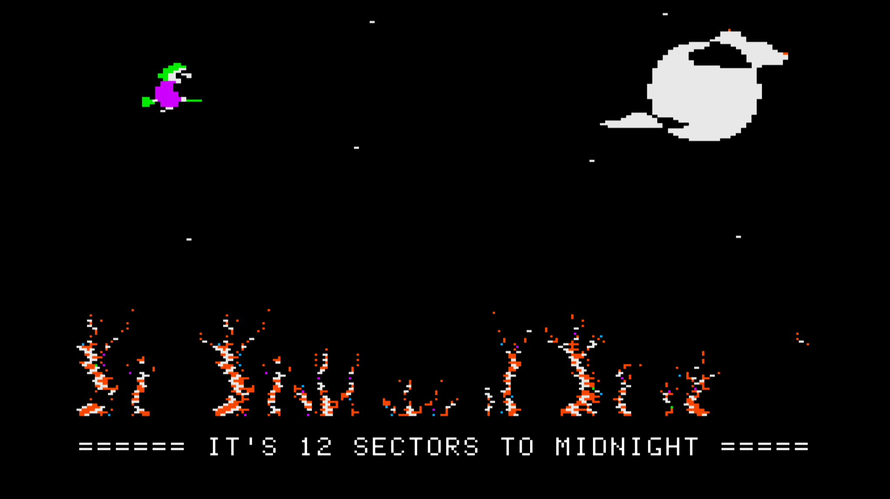

```
         __ ___                _                 _                  _     _       _       _     _   
        /_ |__ \              | |               | |                (_)   | |     (_)     | |   | |  
         | |  ) |___  ___  ___| |_ ___  _ __ ___| |_ ___  _ __ ___  _  __| |_ __  _  __ _| |__ | |_ 
         | | / // __|/ _ \/ __| __/ _ \| '__/ __| __/ _ \| '_ ` _ \| |/ _` | '_ \| |/ _` | '_ \| __|
         | |/ /_\__ \  __/ (__| || (_) | |  \__ \ || (_) | | | | | | | (_| | | | | | (_| | | | | |_ 
         |_|____|___/\___|\___|\__\___/|_|  |___/\__\___/|_| |_| |_|_|\__,_|_| |_|_|\__, |_| |_|\__|
                                                                                     __/ |          
                                                                                    |___/
```           



#### What's this?

A short scroller demo for Apple II (48k and up)

Written by Gil Megidish (www.megidish.net)

For the [*12 Sectors to Midnight Programming Exhibition*](https://www.facebook.com/events/2551527591827790/)

[fhpack](https://github.com/fadden/fhpack/) (lz4) decompression routines by Peter Ferrie & Andy McFadden

##### Stuff you should know

Complete code is provided in this git. You can see that I used photoshop to design the looks. I used `b2d`, and
`bucketshot` to handle the graphics. Photoshop to Apple2.

The sprite of the hag was taken from the game Cauldron for the C64, and modified to match Apple II limitations.

Technically, 12 sectors is 3072 bytes. For some reason, each file I copy to .DSK gets an additional sector. I couldn't find why, but I had to cut some unrolled optimizations and a few text lines, to make this intro fit in 11 sectors.

##### Improvements

- Major speed improvement could be achieved by unrolling the horizontal scroller loop. Even unrolling just 4 times would yield major frame rate improvement.

- The greetings could be compressed by lz4, this would reduce file size by about 140 bytes

- The Y line offset lookup table can be generated in runtime, or can be compressed by lz4. This would reduce by 100 bytes.

- Not all Y lines are being used, so we can reduce that as well :)

- The entire binary can be compressed with lz4 :)))))

But, it was all written in one day over the weekend.
